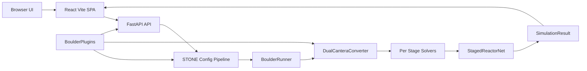

# ARCHITECTURE.md — Boulder

Boulder is a web-based editor and simulator for **Cantera ReactorNet** systems. Users edit **STONE** YAML, view the network in **Cytoscape**, and run simulations with **SSE** streaming to the UI.

**Stack:** FastAPI + Uvicorn (Python 3.11), React + TypeScript + Vite (frontend). Core domain logic lives in package `boulder/`.

Related docs: [AGENTS.md](AGENTS.md), [README.md](README.md), [configs/README.md](configs/README.md).

## High-level data flow


```mermaid
flowchart LR
    User[Browser UI] --> Frontend[React Vite SPA]
    Frontend --> Api[FastAPI API]
    Api --> Config[STONE Config Pipeline]
    Config --> Runner[BoulderRunner]
    Runner --> Converter[DualCanteraConverter]
    Converter --> StageSolvers[Per Stage Solvers]
    StageSolvers --> StagedNet[StagedReactorNet]
    StagedNet --> Results[SimulationResult]
    Results --> Frontend
    PluginSystem[BoulderPlugins] --> Config
    PluginSystem --> Converter
    PluginSystem --> Api
```

## Runtime entrypoints

| Role | Location |
|------|----------|
| ASGI app | `boulder.api.main:app` — `boulder/api/main.py` |
| CLI | `boulder.cli:main` — `boulder/cli.py` (`boulder`, `sim2stone`, `stone2sim`) |
| Programmatic uvicorn | e.g. `run.py`, `docs/usage.rst` |
| SPA bootstrap | `frontend/src/main.tsx` → `App.tsx` |

Production: FastAPI serves `frontend/dist` when present (`boulder/api/main.py`). Dev: Vite dev server proxies `/api` (see README).

## Backend responsibilities

### HTTP API (`boulder/api/`)

Routers mounted in `main.py`:

- `/api/configs` — default / preload / parse / validate / export YAML
- `/api/simulations` — start sim, SSE stream, results, cleanup
- `/api/mechanisms` — mechanism-related API
- `/api/graph` — config → Cytoscape elements and stylesheet
- `/api/plugins` — list metadata and render output-pane plugins (JSON payloads)
- `/api/health` — health check

Lifecycle (`lifespan`): loads `.env` from repo root (optional); registers built-in plugins (e.g. network pane); constructs `DualCanteraConverter`; may preload config from `BOULDER_CONFIG_PATH` / `BOULDER_CONFIG`.

### STONE configuration (`boulder/config.py`)

- **Format version** — Boulder uses **STONE v2** (current). STONE v1 (top-level `nodes:`, `connections:`, `groups:`) is rejected with an actionable error. See [STONE_SPECIFICATIONS.md](STONE_SPECIFICATIONS.md) for the full normative spec.
- **Dialect detection** — `_detect_stone_dialect(raw)` inspects top-level keys and returns `'v2_network'` (single-stage `network:` key), `'v2_staged'` (multi-stage `stages:` + dynamic stage blocks), or `'internal'` (pre-normalized dicts from tests/plugins that already carry `type`/`properties` per-node).
- **Normalization** — `_normalize_v2` converts the detected STONE v2 dialect into Boulder's internal flat format `{nodes, connections, groups}`. Nodes with `initial:` blocks carry seeding state; Reservoir nodes require top-level `temperature:` and `composition:`.
- **Top-level vocabulary** `STONE_V2_BASE_KEYS` — unknown top-level keys in `network:` files are rejected.
- **Pipeline** (order matters): dialect detection → STONE v2 normalisation → `expand_composite_kinds` (plugin unfolders) → connection ordering (e.g. PressureController after its `master` MFC) → default group synthesis → return.
- **Plugins at config time:** `expand_composite_kinds` uses `BoulderPlugins.reactor_unfolders` registered via `register_reactor_unfolder`.

### Converter and plugins (`boulder/cantera_converter.py`)

`BoulderPlugins` aggregates:

- `reactor_builders`, `connection_builders`, `post_build_hooks`
- `reactor_unfolders` (config-time satellite expansion)
- `output_pane_plugins`, `summary_builders`, optional `sankey_generator`, `mechanism_switch_fn`
- `sources` — provenance for `boulder plugins list`

`get_plugins()` discovers once and caches: **entry points** group `boulder.plugins`, then **`BOULDER_PLUGINS`** env (comma/semicolon-separated modules with `register_plugins(plugins)`), then merges global output-pane registrations.

### Orchestration (`boulder/runner.py`)

**`BoulderRunner`** is the YAML → staged solve → visualization network → typed result orchestrator:

- `from_yaml(path)` — load, normalise, validate
- `build()` — run staged solve, build drawable `ct.ReactorNet`, set downloadable script (`self.code`). After `build()`, `self.network` is the raw **`ct.ReactorNet`** visualization network.
- `solve()` — builds `SimulationResult` via `make_simulation_result`; **`self.network` becomes the same `StagedReactorNet`** as `self.result.network`.

Optional `plugins=` and `converter_class` on subclasses swap converter behavior (e.g. downstream products).

### Staged network facade (`boulder/staged_network.py`)

**`StagedReactorNet`** is a **duck-typed facade**, not a single global CVODE stepper:

- `visualization_network` — raw **`ct.ReactorNet`** for drawing, Sankey, etc.
- `networks` — `stage_id` → concrete stage solver network objects
- `reactors` — unique global reactors from the visualization net (deduplicated by Python `id`)
- `trajectory` — `LagrangianTrajectory` from staged solve
- `scalars` — flat plugin scalars keyed as `{stage_id}.{key}`
- Implements `draw`, `time`, `get_stage(stage_id)`. **Do not** expect `advance()` on the facade; use `visualization_network.advance(...)` if you truly need raw stepping.

### Typed results (`boulder/simulation_result.py`)

**`SimulationResult`** holds:

- `config` — normalized config
- **`network`** — **`StagedReactorNet`** (not separate `network_viz` / top-level `networks`)

Plus flow maps (`connection_mass_flows_kg_s`, per-node aggregates) and `per_reactor_states` snapshots.

### Background simulation (`boulder/simulation_worker.py`)

`SimulationWorker` runs Cantera integration in a thread, streams progress (including staged build progress where applicable).

### Reactor series metadata for plots

Simulation plot data is carried as `reactors_series`, keyed by reactor id. The baseline payload for each
reactor is `{T, P, X, Y}` arrays plus the global `times` array. Staged steady solves usually produce a
single sample at `t = 0.0`; this is still valid plot data and should be rendered as a steady snapshot.

Spatial/PFR-like visualization is opt-in metadata, not inferred from a reactor name or type in the UI:

- A reactor builder or custom stage network can attach `spatial_series_fn` to
  `DualCanteraConverter.reactor_meta[reactor_id]`.
- During `run_streaming_simulation`, that function replaces the single-point snapshot with its returned
  series.
- A spatial series sets `is_spatial: true` and provides spatial axes such as `x` (position) and optional
  `t` (residence time). It may also include `fbs_convergence` for the Convergence tab.
- PSR/CSTR-style metadata uses `is_psr: true`, inherited from `reactor_meta[reactor_id]["is_psr"]`.

These flags are part of the public backend-to-frontend data contract. `SimulationWorker` preserves extra
series keys when copying progress snapshots, the SSE/results API forwards them unchanged, and
`frontend/src/types/simulation.ts` models them on `ReactorSeries`. Frontend result tabs choose their
plot mode from the inherited series metadata (`is_spatial`, `is_psr`, etc.); they should not re-classify
reactors by kind string.

### Result serialization (`boulder/payload_store.py`)

A computed result is persisted in **one** composite-HDF5 format, shared by the result cache and the
scenario inspector — so there is a single on-disk encoding and a single payload builder. Numerics are
stored as natively-to-Cantera as possible; everything else rides alongside as JSON.

- **`solution` tier** — a state series (`T`/`P`/`X` over an index) whose species the mechanism can
  represent (and whose `X` rows are normalized) is saved as a Cantera `SolutionArray` group. `Y` is
  *derived* on load. **Every per-state numeric column rides along as an `extra`** — `t` (time) *and*
  `x` (position), so a **PFR spatial profile is stored natively here** (it's a Lagrangian state
  sequence), not dumped to JSON.
- **`arrays` tier** — same shape but the mechanism can't represent it (mechanism-switch reactors, or
  non-normalized `X`): binary HDF5 datasets (one per extra column too) — no `Solution` needed to read.
- **`raw` tier** — only genuinely non-state structures land here, verbatim in the JSON blob.
- **Non-per-state fields** — flags (`is_spatial`, `is_psr`, `is_residence`) and off-shape arrays
  (`fbs_convergence`, which is per-FBS-iteration, not per-state) ride in each reactor's `meta` in the
  index and are merged back on load.
- **`payload_json` dataset** — the rest of the `SimulationResults` (Sankey, reports, summary, code,
  node/connection overlays) plus a `reactors_index` mapping each reactor to its tier/group.

#### One result store, keyed by name

There is a single store, `boulder/scenario_store.py`. Every solve lands in it —
a whole sweep or a single run — because `expand_scenarios` always yields at
least one entry, so "single-shot" and "sweep" are the same code path at N=1 and
N=3. One HDF5 file per run-set entry:

```
<config_dir>/.boulder-cache/<stem>/
    BASELINE.h5 | <scenario_id>.h5
    artifacts/<scenario_id>/...
```

The **name** is the key; the `fingerprint` attr under that name is the
staleness check. One file per entry rather than one grouped file because HDF5
is single-writer and the GUI polls the store while a solve writes it:
per-entry files remove contention, confine a partial write to one entry, make
invalidating one entry a file delete, and leave room to solve entries in
parallel.

Boulder previously had **two** stores answering two questions — a
content-addressed `.boulder-cache/<fp>/` ("solved this exact config before?",
LRU-capped at 5) and a name-addressed `<stem>_scenarios.h5` ("what is in this
run-set, and what is each called?"). They collided on BASELINE, which lives in
both worlds and hashed differently in each, so the Scenario pane could report a
scenario "computed" that Run Sweep would immediately re-solve. `result_cache.py`
kept its *identity* layer (`compute_fingerprint`, `cache_dir_for`, the
contributor registry) and lost its *storage* layer entirely.

Two invariants the store enforces, since name-addressing loses the
collision-immunity hashing gave for free:

- **Never serve another config's results.** Under a shared `$BOULDER_CACHE_DIR`
  the directory name folds in the config's absolute path, and every file records
  the config it belongs to; a mismatch rebuilds rather than serving a wrong
  answer.
- **Never serve a half-written result.** `fingerprint` is the validity signal,
  so it is written *last*. A solve that dies midway leaves a file with no
  fingerprint — read as "not computed", which is what it is.

##### No history — that is what scenarios are for

An entry holds **one** result, the latest. Re-running an unchanged entry is a
hit; going *back* to a previous value re-solves. This is deliberate: keeping an
old value around is what authoring a scenario is for, not what a cache is for.

A plausible future feature is to **auto-create a scenario** when the user edits
a parameter, preserving the previous value. Each such entry would be *a scenario
like any other* — named, listed, plottable, with its own file — which is why
dropping content-addressing does not foreclose history; it changes how history
is expressed. **Not implemented.**

**Mechanism provenance vs. cache identity** — two different things, easily confused:

- The store's per-entry **`mechanism_sha256` attr is provenance only**, and is written by
  `payload_store._resolve_mechanism`, which hashes the file *only when the mechanism resolves to an
  existing path*. For a **Cantera built-in** (`gri30.yaml`) it stores the bare name and an **empty
  hash** — so a stored result records *which* built-in it used, but not its exact content.
- **Cache invalidation does not depend on that attr.** `result_cache._mechanism_identity` keys a
  built-in as `builtin:<name>@cantera-<version>`, so upgrading Cantera *does* invalidate cached
  results that used a built-in.
- **Known, accepted limitation:** a built-in whose content changed *without* a Cantera version bump
  would not invalidate the cache. Built-in mechanisms are not expected to change within a release, so
  this is tolerated rather than defended against. Filling in the hash is feasible if provenance ever
  matters — a built-in is locatable by scanning `cantera.get_data_directories()` for the name — but it
  would only strengthen the recorded provenance, not cache correctness.

#### Run-set expansion and the sweep runners (GUI in-process, CLI out-of-process)

`runset.py` is the reference implementation of the STONE `scenarios:`/`sweep:` semantics
(STONE_SPECIFICATIONS.md §14): `expand_scenarios` (union run-set, id-keyed `deep_merge`, sweep-path
resolution against the schema registry), `run_set_size` (the cheap count the `/api/sweep` availability
endpoint uses — same module, so the count can never drift from the expansion), `sweeps_of`,
`sweep_axis_values`, `resolve_store_path`, and `load_yaml_with_inheritance` (`from:` chains;
`scenarios:` is deliberately not inherited, `sweep:` is).

The GUI's Run Sweep button (`api/routes/sweep.py`) runs **in-process**, in a background thread:
`expand_scenarios` the caller's base-config snapshot ⊕ its current `scenarios` (the frontend's
in-memory `scenarioStore.overlays` — scenario authoring never touches disk, see
`boulder/scenario_editor.py`) → skip runs whose per-scenario fingerprint is unchanged (incremental
cache; `no_cache` in the request recreates the store) → solve each one through the exact same
`SimulationWorker` a plain "Run Simulation" uses (no separate solve implementation) →
`write_payload` one group per scenario → prune groups whose id left the run-set.

`sweep_runner.py` (`python -m boulder.sweep_runner <config.yaml>`) is a separate, disk-based,
out-of-process runner for headless/CLI use — the GUI route above does not call it. `boulder --sweep --headless` invokes it by default; `plugins.sweep_runner` overrides that argv for a host whose CLI
sweep is genuinely different. Sweep-id naming is customized via `plugins.sweep_symbols`.

**Per-scenario host hooks fire on both paths.** Two seams let a host attach to each freshly solved
scenario (cache hits fire neither):

| Plugin field | Signature | Purpose |
|---|---|---|
| `scenario_attrs` | `(scenario_id, merged_config, gui_payload) -> dict` | Extra **scalar** attrs on the scenario's HDF5 group — the per-run KPIs the Scenario pane's Sweep Results plot offers as axes |
| `on_scenario_solved` | `(scenario_id, config, converter, simulation_result, fingerprint, gui_payload, mechanism) -> None` | Persist per-scenario artifacts keyed by the same fingerprint — e.g. writing each scenario into the single-run result cache so a later "Export" reuses the sweep's work instead of re-solving |

`sweep_runner.run()` also accepts both as arguments (an explicit argument wins; otherwise it falls
back to the plugin fields), so the CLI and the GUI record identical attributes. Both are best-effort:
a raising hook is caught and logged, never aborting the run.

These were originally `run()` parameters only, which meant a host could reach them *solely* through
an out-of-process runner. Once Run Sweep moved in-process and stopped launching one, a host that
registered them silently got nothing from the GUI button — including, for one host, result-cache
population, so its report export re-solved every scenario. Anything a host must do per
scenario belongs on these plugin fields, not on a subprocess entry point.

The Sweep Results plot (`frontend/src/components/panels/SweepResultsPlot.tsx`) renders **nothing**
until a store has at least two numeric per-scenario attrs to plot against each other. Boulder's own
attrs (`label`, `fingerprint`, `mechanism*`) are strings, and `order` / `computed_at` /
`schema_version` are explicitly excluded as bookkeeping — so the plot is invisible unless a host
supplies KPIs via `scenario_attrs`. Names it renders nicely: `t0_K` (default X axis),
`final_temperature_K`, `final_X_<species>` (grouped as Mole Fractions), `final_Y_<species>` (Mass
Fractions).

#### Why the sweep is sequential, and what parallelising it would take

The in-process sweep solves scenarios **one at a time**. Its background thread exists so the API
stays responsive during a long run (`/api/sweep/status` keeps answering) — *not* to overlap compute.

Threads cannot overlap Cantera compute: **Cantera does not release the GIL** during
`ReactorNet.step()`/`advance()`. Measured on Cantera 3.2.0, four identical ignition solves:
sequential 1.11 s vs. four threads 1.10 s — **1.01×**. Adding a thread pool here would buy exactly
nothing. Real parallelism requires **processes**, whose measured payoff depends on per-scenario cost
(4 workers, 8 cores, Windows `spawn`):

| per-scenario solve | speedup with 4 processes |
|---|---|
| 0.26 s | 0.63× (slower — pool startup dominates) |
| 1.0 s | 1.70× |
| 4.2 s | 3.21× |
| 10.4 s | 3.72× |

Worker startup costs ~1.3 s (re-import Cantera, re-parse the mechanism), paid once per pool rather
than per scenario, so it amortises over a long sweep but makes parallelism a net loss for fast ones.

Parallelism is **not needed today**, but the current design deliberately keeps the door open. Preserve
these invariants:

- **`scenario_progress` is a map keyed by scenario id, not a "current scenario" scalar.** It can
  already describe several in-flight scenarios at once, so the `/api/sweep/status` contract would not
  change.
- **`order` is stored as an explicit attr**, so scenarios completing out of order stay presentable in
  authored order.
- **Keep HDF5 writes on one thread.** Concurrent writers corrupt an HDF5 file without SWMR. Workers
  should return payloads and let the parent write them; writes are milliseconds against multi-second
  solves, so serialising them costs effectively nothing.
- **Keep the per-scenario hook return values plain data.** A converter holding a live Cantera
  `Solution` cannot cross a process boundary. Anything needing Cantera — including mechanism
  resolution — must finish inside the worker, which is why `scenario_attrs` returns scalars rather
  than objects.
- **Worker count must be configurable, not `cpu_count()`.** N workers hold N copies of the mechanism;
  a large one makes memory, not cores, the binding constraint.

Going multi-process would also restore the crash isolation that the in-process rewrite gave up: a
Cantera segfault currently takes down the whole GUI server, where the old subprocess only lost the
child.

Both call `payload_store.gui_payload_from_solution_array` to rebuild the same `SimulationResults` the
GUI renders. `CACHE_VERSION` (in `result_cache.py`) gates cache entries; `PAYLOAD_SCHEMA` (== the root
`schema_version` attr) versions the HDF5 layout. Mechanism is stored as a resolved path + sha256; an
unresolved mechanism on read is a graceful cache miss, never a crash.

#### Scenario-focus channel (remote control)

`api/routes/scenarios.py` exposes a generic seam so an **external process** (e.g. a separate result
dashboard) can drive the open GUI to load a scenario, without polling or a page reload:

- `POST /api/scenarios/focus` `{scenario_id}` — validates the id against the active store and pushes it
  onto every subscriber (an in-process set of `asyncio.Queue`s on `app.state`); also remembered as
  `app.state.focused_scenario`.
- `GET /api/scenarios/focus/stream` — SSE; emits the current focus on connect (late-joiner sync) then
  one `focus` event per POST. The frontend `useScenarioFocus` hook subscribes and calls the existing
  `scenarioStore.setActive(id)` sink, so the trajectory appears in the Plots tab in place.

The push carries only a scenario id (domain-neutral). A typical use: a dashboard `POST`s a focus from a
server-side click handler — no browser CORS involved, since the GUI's own same-origin tab is the only
SSE subscriber.

### Frontend (`frontend/src/`)

- **API** — `api/client.ts`, `configs.ts`, `simulations.ts`, `mechanisms.ts`, `plugins.ts`
- **State** — Zustand stores (`configStore`, `simulationStore`, `selectionStore`, etc.)
- **Graph / results** — `ReactorGraph`, `ResultsTabs`, `PluginTab`, `useSimulationSSE`, `useScenarioFocus`

Plugins: `GET /api/plugins` lists tabs; `POST /api/plugins/{id}/render` returns structured JSON (image, table, html, plotly, etc.) consumed by `PluginTab`.

#### Page-reload / late-joiner behavior

All frontend state (simulation ID, results, post-solve topology) lives in **in-memory Zustand stores** and is not persisted to localStorage or sessionStorage. On a full page reload:

1. The graph resets to the YAML-loaded config (stream-point diamonds are absent until
   the next solve).
1. `simulationStore.simulationId` is `null`; `useSimulationSSE` does not reconnect.
1. Any completed simulation on the server is still accessible via
   `GET /api/simulations/{id}/results`, but the ID is not known to the fresh page.

`fetchSimulationResults` in `api/simulations.ts` exists for programmatic use (e.g. tests,
headless scripts) but is intentionally not called on mount — the correct action after a
reload is simply to re-run the simulation. This keeps the UI stateless and avoids a
polling/persistence layer that would require server-side session management to be
meaningful after a server restart.

## Plugin and extension system

This section subsumes the former root **`PLUGIN_SYSTEM.md`** (removed; content lives here).

### Overview

Downstream packages can extend Boulder without forking core code:

- Custom **output panes** (results tabs) with JSON payloads to the React UI
- **Reactor builders**, **connection builders**, **post-build hooks**
- **Composite reactors** via **ReactorUnfolder** (satellite nodes at normalize time)
- Optional **Pydantic** schemas for `boulder validate` / `boulder describe`
- **Summary builders**, custom **Sankey**, **mechanism_switch_fn** for staged solves

### Base classes (output panes)

- **`OutputPanePlugin`** — abstract base for output pane plugins
- **`OutputPaneContext`** — simulation data, selection, config, theme, progress
- **`OutputPaneRegistry`** — global registry; re-registering the same `plugin_id` is a no-op

Implementation: `boulder/output_pane_plugins.py`.

### Plugin definition and discovery

A Boulder plugin is a Python module that exposes a registrar function:

```python
def register_plugins(plugins: BoulderPlugins) -> None:
    ...
```

The registrar mutates the shared `BoulderPlugins` container by registering
reactor builders, connection builders, post-build hooks, unfolders, and/or
output-pane extensions.

### Discovery paths

Two mechanisms both **add** to the same `BoulderPlugins` container:

1. **Entry points (`boulder.plugins`)** — packaged plugins via `pip`. In `pyproject.toml`:

   ```toml
   [project.entry-points."boulder.plugins"]
   my_plugin = "my_package.boulder_plugins:register_plugins"
   ```

1. **`BOULDER_PLUGINS`** — comma- or semicolon-separated module names for local development. `boulder/cli.py` and `boulder/api/main.py` load a repo-root `.env` so you can set:

   ```bash
   BOULDER_PLUGINS=my_local_pkg.boulder_plugins
   ```

**Import resolution:** module names from `BOULDER_PLUGINS` are imported via
`importlib.import_module(...)` and therefore resolve using normal Python
`sys.path` rules (active environment site-packages, editable installs,
working directory, etc.).

### Inspecting what loaded

```bash
boulder plugins list
```

### Optional: declarative schema for a reactor kind

Use `boulder.register_reactor_builder` so `boulder validate` and `boulder describe` work without running Cantera:

```python
from pydantic import BaseModel, Field
from boulder import register_reactor_builder

class MyReactorSchema(BaseModel):
    length: float = Field(..., description="[m] Reactor length")
    diameter: float = Field(..., description="[m] Reactor diameter")

def register_plugins(plugins):
    register_reactor_builder(
        plugins,
        kind="MyReactor",
        builder=_build_my_reactor,
        network_class=MyReactorNet,
        schema=MyReactorSchema,
        categories={
            "inputs": {"GEOMETRY": ["length", "diameter"]},
            "outputs": {"OUTLET": ["T_outlet_K"]},
        },
        default_constraints=[
            {
                "key": "T_outlet_K",
                "description": "Max outlet T",
                "operator": "<",
                "threshold": 1800.0,
            },
        ],
    )
```

Direct assignment `plugins.reactor_builders[kind] = fn` still works without schema metadata (`boulder/schema_registry.py`).

### Creating an output pane plugin

**1. Implement the plugin class**

```python
from boulder.output_pane_plugins import OutputPanePlugin, OutputPaneContext

class MyPlugin(OutputPanePlugin):
    @property
    def plugin_id(self) -> str:
        return "my_plugin"

    @property
    def tab_label(self) -> str:
        return "My Analysis"

    @property
    def requires_selection(self) -> bool:
        return True

    def is_available(self, context: OutputPaneContext) -> bool:
        return context.selected_element is not None

    def create_content_data(self, context: OutputPaneContext):
        return {"type": "text", "content": "My custom analysis content"}
```

**2. Register**

```python
def register_plugins(plugins):
    from boulder.output_pane_plugins import register_output_pane_plugin

    register_output_pane_plugin(MyPlugin())
```

**3. Enable discovery** — `BOULDER_PLUGINS` and/or `boulder.plugins` entry points (see above).

**Selection-scoped tabs.** A pane with `requires_selection = True` only surfaces
its tab while something is selected in the graph. The optional
`supported_node_types` property (list of STONE reactor kinds, e.g.
`["MyReactorKind"]`) narrows this further: the tab appears only while a node of
one of those kinds is selected, and disappears (falling back to a base tab)
when the selection changes. Panes with `requires_selection = False` are always
listed once results exist — appropriate for stage-group-level views.

**Content types.** `create_content_data` may return `text`, `html`, `image`
(base64 data URI), `table` (`headers` + `rows`), **`plotly`**
(`{"figure": {"data": [...], "layout": {...}}}` rendered as a native
interactive react-plotly widget; theme-aware fonts, background and grid colors
are injected client-side unless the figure sets its own), and **`grid`**
(`{"columns": n, "items": [...]}`, recursive). Multi-panel plotly figures can
lock their x-axes together with `xaxis2: {matches: "x"}` for synchronized
zooming.

**Host branding.** A plugin package may set
`plugins.branding = {"name": ..., "version": ...}` in its registrar; the GUI
header then shows the host application name and version instead of the plain
Boulder title (config `metadata.gui_app_title/-version` still takes
precedence). Exposed at `GET /api/ui/branding`.

**Custom connection kinds.** `plugins.connection_builders["MyEdgeKind"]`
registers a builder `(converter, conn_dict) -> device` dispatched before the
built-in flow devices. The returned object need not be a Cantera flow device —
non-flow edges (e.g. electrical wiring between plugin blocks) are tolerated
throughout reporting, letting hosts express Simulink-style signal connections
as first-class STONE edges.

### HTTP API for plugins

- `GET /api/plugins` — metadata incl. `requires_selection`,
  `supported_element_types`, `supported_node_types` (`boulder/api/routes/plugins.py`)
- `POST /api/plugins/{plugin_id}/render` — body maps to `OutputPaneContext`; returns `{available, data}`
- `GET /api/ui/branding` — host branding declared by a plugin package

### Optional spatial-style output pane (downstream plugin)

A separate plugin package can ship an output-pane plugin (for example analyzing reactors that declare a `length` property and emitting spatial summaries). Discovery is via `boulder.plugins` entry points or `BOULDER_PLUGINS`, like any other plugin. Example YAML snippet (conceptual):

```yaml
nodes:
  - id: tubular_reactor
    IdealGasReactor:
      temperature: 800
      pressure: 1.0
      composition: "CH4:1,O2:2,N2:7.52"
      volume: 0.001
      length: 2.0
```

### Plugin context fields

`OutputPaneContext`: `simulation_data`, `selected_element`, `config`, `theme`, `progress`.

### Best practices

1. **Graceful degradation** for missing optional dependencies
1. **Error handling** in plugin code paths
1. **Avoid heavy work** in `is_available()`
1. **UI consistency** with existing components
1. **Document** requirements and usage

### Troubleshooting

- Tab missing — check `BOULDER_PLUGINS` / entry points
- Import errors — install dependencies
- Callback conflicts — unique component IDs
- Performance — profile hot paths

### Composite reactors — `ReactorUnfolder`

Some kinds own satellite **Reservoir** / **Wall** (etc.) objects. Register an unfolder with **`register_reactor_unfolder(plugins, kind, fn)`**; it runs in **`expand_composite_kinds`** so satellites appear in the graph, staged solver, and `ct.ReactorNet` topology.

**Example registration**

```python
from boulder import register_reactor_unfolder

def _my_unfolder(node):
    rid = node["id"]
    group = node.get("group") or (node.get("properties") or {}).get("group")
    mech = node.get("mechanism") or (node.get("properties") or {}).get("mechanism")
    ambient_props = {
        "temperature": 298.15,
        "pressure": 101325.0,
        "composition": "N2:1",
        **({"group": group} if group else {}),
        **({"mechanism": mech} if mech else {}),
    }
    return {
        "nodes": [
            {
                "id": f"{rid}_ambient",
                "type": "Reservoir",
                "properties": ambient_props,
                **({"group": group} if group else {}),
            }
        ],
        "connections": [
            {
                "id": f"{rid}_loss_wall",
                "type": "Wall",
                "source": f"{rid}_ambient",
                "target": rid,
                "properties": {"area": 1.0},
            },
        ],
    }

def register_plugins(plugins):
    register_reactor_unfolder(plugins, "MyCompositeReactor", _my_unfolder)
```

**Design rules**

1. **Parent-prefixed ids** — `{node_id}_...` to avoid collisions across instances
1. **Collisions** — duplicate id with different content → `ValueError`; byte-identical re-unfold is a no-op
1. **Conditional satellites** — return `{}` when no satellites (e.g. adiabatic)
1. **Group + mechanism** — propagate to emitted nodes for correct staging and mechanisms
1. **Post-build hooks** — may attach physics on the built `Wall` / `Reservoir` using deterministic ids

**Order vs port shortcuts**

`expand_composite_kinds` runs **after** `expand_port_shortcuts`:

```
STONE normalisation → expand_port_shortcuts → expand_composite_kinds
  → _sort_connections_by_master → synthesize_default_group
```

### `post_build` hooks — topology constraint

`post_build` hooks registered in `plugins.post_build_hooks` receive a **per-stage subset
config** of the form `{"nodes": <stage_nodes>, "connections": <stage_connections>}`.
This is a new `dict` whose `"nodes"` and `"connections"` values are fresh lists extracted
from the full top-level config for that stage only.

**Consequence**: mutations that add or remove entries to `cfg["nodes"]` or
`cfg["connections"]` inside a `post_build` hook only affect the local stage subset
list — they do **not** propagate to the top-level `config["nodes"]` / `config["connections"]`
that `simulation_worker` reads after the build to populate `updated_nodes` /
`updated_connections` for the SSE `complete` event.

What **does** propagate:

- In-place mutations of existing node/connection **dicts** (e.g.
  `cfg["nodes"][0]["properties"]["foo"] = value`) — because the dicts are shared
  references from the top-level config.
- Physics attached to already-built Cantera objects (walls, MFC rates, etc.) — these
  do not need to appear in the YAML dict at all.

What does **not** propagate:

- Appending brand-new node or connection dicts to the stage subset lists.
- Replacing the lists wholesale (e.g. `cfg["nodes"] = [...]`).

**Recommended pattern** for plugins that need to add topology visible to the frontend:
use a `ReactorUnfolder` (runs at normalize-time, before `build_network`) or inject
directly into `config["nodes"]` / `config["connections"]` in a reactor builder before
returning. Do not rely on `post_build` for topology that must appear in the graph.

### Working example in this repo

- `examples/plugin_example.py` — fictional **Monolith** reactor
- `tests/test_plugin_example.py`
- Sphinx: `docs/auto_examples/` / `docs/usage.rst`

### Future plugin ideas (non-binding)

- Hot-reload, plugin config UI, richer context, dependency metadata, registry/marketplace

## CI and release

- **CI** — [.github/workflows/on-push.yml](.github/workflows/on-push.yml): pre-commit, merged conda envs, Python 3.11 `make unit-tests`, `make type-check`, frontend `npm ci` + test/typecheck/build, `make docs-build`, deploy docs to GitHub Pages on `main`
- **Release** — [.github/workflows/release.yml](.github/workflows/release.yml): on `release: published`, `python -m build`, attach wheel + sdist (`fetch-depth: 0` for setuptools_scm)

## Tests that encode architecture invariants

- `tests/test_runner.py` — `BoulderRunner`, `StagedReactorNet` / `SimulationResult.network` identity
- `tests/test_unfold.py` — `expand_composite_kinds`, Wall branches, collisions
- `tests/test_plugin_example.py` — Monolith plugin example
- `tests/README.md` — markers, E2E notes

## Public Python surface (`boulder/__init__.py`)

Exports include `BoulderRunner`, `SimulationResult`, `make_simulation_result`, `CustomStageNetwork`, `LagrangianTrajectory`, schema helpers (`register_reactor_builder`, `register_reactor_unfolder`, `registered_kinds`, …), and metadata models from `validation.py`.

Version: dynamic via setuptools_scm → `boulder/version.py`; `__init__.__version__` may lag — prefer installed package metadata when documenting releases.
