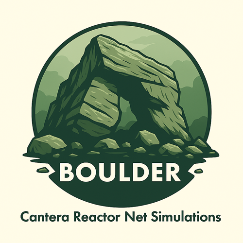

# Cantera ReactorNet Visualizer



A web-based tool for visually constructing and simulating Cantera ReactorNet systems using Dash and Cytoscape.

## Features

- Interactive graph editor for creating reactor networks
- Support for various reactor types (IdealGasReactor, Reservoir)
- Support for flow devices (MassFlowController, Valve)
- Real-time property editing
- Simulation capabilities with time-series plots
- JSON configuration import/export


## Installation

It is recommended to install this package in a dedicated environment. Clone the repository and create
an isolated environment :

```
git clone https://github.com/parks4/boulder.git
cd boulder
conda env create -n boulder -f environment.yml
conda activate boulder
pip install -e .         # install in editable mode
```

## Usage

1. Start the application:
   ```bash
   python run.py
   ```
1. Open your web browser and navigate to `http://localhost:8050`
1. Use the interface to:
   - Upload existing configurations
   - Create new reactor networks
   - Edit properties
   - Run simulations
   - View results

## Configuration Format

The application uses a JSON-based configuration format:

```json
{
  "components": [
    {
      "id": "reactor1",
      "type": "IdealGasReactor",
      "properties": {
        "temperature": 1000,
        "pressure": 101325,
        "composition": "CH4:1,O2:2,N2:7.52"
      }
    }
  ],
  "connections": [
    {
      "id": "mfc1",
      "type": "MassFlowController",
      "source": "res1",
      "target": "reactor1",
      "properties": {
        "mass_flow_rate": 0.1
      }
    }
  ]
}
```

## Supported Components

### Reactors

- IdealGasReactor
- Reservoir

### Flow Devices

- MassFlowController
- Valve

## Contributing / Developers

Feel free to submit issues and enhancement requests!
Before pushing to GitHub, run the following commands:

1. Update conda environment: `make conda-env-update`
1. Install this package in editable mode: `pip install -e .`
1. (optional) Sync with the latest [template](https://github.com/spark-cleantech/package-template) : `make template-update`
1. (optional) Run quality assurance checks (code linting): `make qa`
1. (optional) Run tests: `make unit-tests`
1. (optional) Run the static type checker: `make type-check`
1. (optional) Build the documentation (see [Sphinx tutorial](https://www.sphinx-doc.org/en/master/tutorial/)): `make docs-build`

If using Windows, `make` is not available by default. Either install it
([for instance with Chocolatey](https://stackoverflow.com/questions/32127524/how-to-install-and-use-make-in-windows)),
or open the [Makefile](./Makefile) and execute the lines therein manually.

## License

```
Copyright (C) Spark Cleantech SAS (SIREN 909736068) - All Rights Reserved
Unauthorized copying of this file, via any medium is strictly prohibited
Proprietary and confidential
Written by Erwan Pannier <erwan.pannier@spark-cleantech.eu>, June2025
```
