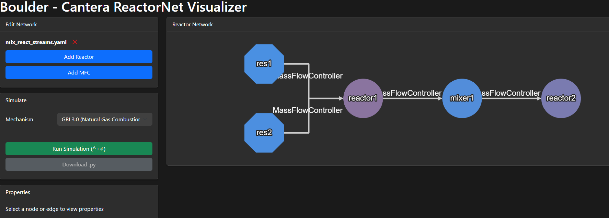

# Cantera ReactorNet Visualizer


A web-based tool for visually constructing and simulating Cantera ReactorNet systems.

**Architecture:** FastAPI (Python backend) + React (TypeScript frontend) with Vite, Tailwind CSS, Zustand, and TanStack Query.

## Features

- Interactive graph editor for creating reactor networks (Cytoscape.js)
- Support for various reactor types (IdealGasReactor, Reservoir)
- Support for flow devices (MassFlowController, Valve, Wall)
- Real-time property editing with unit conversion (K/°C)
- Simulation with SSE streaming and live-updating Plotly charts
- Results tabs: Temperature/Pressure plots, Sankey, Thermo reports, Summary
- Monaco YAML editor with syntax highlighting
- Extensible plugin system (JSON-based API)
- Light/dark theme with OS preference detection
- YAML configuration files with 🪨 STONE standard (elegant format)



## Installation

Clone the repository and create an isolated environment:

```bash
git clone https://github.com/parks4/boulder.git
cd boulder
conda env create -n boulder -f environment.yml
conda activate boulder
pip install -e .         # install in editable mode

# Build the React frontend
cd frontend
npm install
npm run build
cd ..
```

## Usage

### From the CLI

After installation, use the `boulder` command:

```bash
boulder                 # starts the FastAPI server & opens the interface
boulder some_file.yaml  # starts with a YAML preloaded
```

Optional flags:

```bash
boulder --host 0.0.0.0 --port 8050 --debug  # customize host/port, enable auto-reload
boulder some_file.yaml --no-open             # do not auto-open the browser
boulder config.yaml --headless --download output.py  # headless code generation
```

### Development Mode

Run the FastAPI backend and Vite dev server simultaneously:

```bash
# Terminal 1: Backend API
uvicorn boulder.api.main:app --reload --port 8000

# Terminal 2: Frontend dev server (auto-proxies /api to port 8000)
cd frontend
npm run dev
```

Open `http://localhost:5173` in your browser.

### From Python

```python
import uvicorn
uvicorn.run("boulder.api.main:app", host="127.0.0.1", port=8000)
```

Notes:

- Default address is `http://127.0.0.1:8050`.
- The API documentation is available at `http://localhost:8000/docs` (Swagger UI).
- Set `BOULDER_USE_DASH=true` to use the legacy Dash frontend.

Once running, use the interface to:

- Upload existing configurations
- Create new reactor networks
- Edit properties
- Run simulations
- View results

## YAML Configuration with 🪨 STONE Standard

Boulder uses **YAML format with 🪨 STONE standard** (**Structured Type-Oriented Network Expressions**) - an elegant configuration format where component types become keys containing their properties:

```yaml
metadata:
  name: "Reactor Configuration"
  version: "1.0"

simulation:
  mechanism: "gri30.yaml"
  time_step: 0.001
  max_time: 10.0

nodes:
  - id: reactor1
    IdealGasReactor:
      temperature: 1000      # K
      pressure: 101325       # Pa
      composition: "CH4:1,O2:2,N2:7.52"

connections:
  - id: mfc1
    MassFlowController:
      mass_flow_rate: 0.1    # kg/s
    source: res1
    target: reactor1
```

See [`configs/README.md`](configs/README.md) for comprehensive YAML with 🪨 STONE standard documentation and examples.

## Supported Components

### Reactors

- IdealGasReactor
- Reservoir

### Flow Devices

- MassFlowController
- Valve

## Contributing / Developers

Feel free to submit issues and enhancement requests!
Before pushing to GitHub, run the following commands:

1. Update conda environment: `make conda-env-update`
1. Install this package in editable mode: `pip install -e .`
1. (optional) Sync with the latest [template](https://github.com/spark-cleantech/package-template) : `make template-update`
1. (optional) Run quality assurance checks (code linting): `make qa`
1. (optional) Run tests: `make unit-tests`
1. (optional) Run the static type checker: `make type-check`
1. (optional) Build the documentation (see [Sphinx tutorial](https://www.sphinx-doc.org/en/master/tutorial/)): `make docs-build`

If using Windows, `make` is not available by default. Either install it
([for instance with Chocolatey](https://stackoverflow.com/questions/32127524/how-to-install-and-use-make-in-windows)),
or open the [Makefile](./Makefile) and execute the lines therein manually.

## License

```
Copyright (C) Spark Cleantech SAS (SIREN 909736068) - All Rights Reserved
Unauthorized copying of this file, via any medium is strictly prohibited
Proprietary and confidential
Written by Erwan Pannier <erwan.pannier@spark-cleantech.eu>, June2025
```
